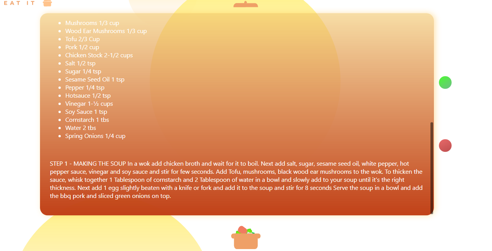

# Eat-it PWA - aplikacja do losowania przepisów

### Projekt stworzony w React'cie przy pomocy themeal API. Animacje zostały stworzone za pomocą Gsapa a zaptania do API tworzone przez axiosa. Aplikacja internetowa PWA, testowana na komputerze i urządzeniu z Androidem. Pozwala na losowanie przepisu, a także pobranie pdf z interesującym nas przepisem. 

Link do strony: https://pkpk7.github.io/eat_it/

Strona startowa aplikacji

 

Po najechaniu na komputerze myszką na poruszając się svg na środku ekranu, wyświetli się odpowiednia animacja zachęty kliknięcia, która przeniesie nas do nowego widoku - otworzy diva z przepisem.

Stron razem z przepisem

 
 

Po kliknięciu w czerwony przycisk, wyświetlana jest odpowiednia animacja która zmienia przepis. Po naciśnięciu przycisku zielonego rozpoczna się pobieranie odpowiedniego pdfa, razem z przepisem. 

Przykładowy [pdf](./readMeScreens/recipe.pdf)
